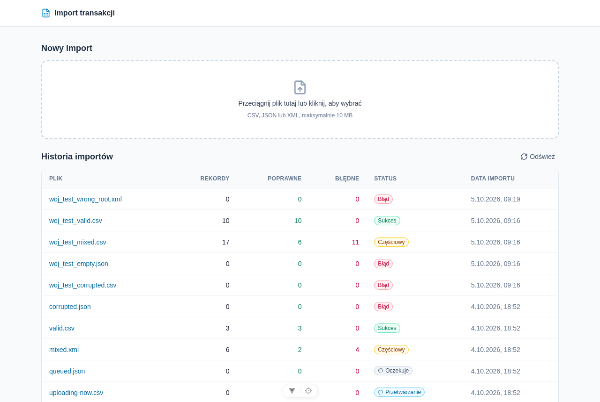
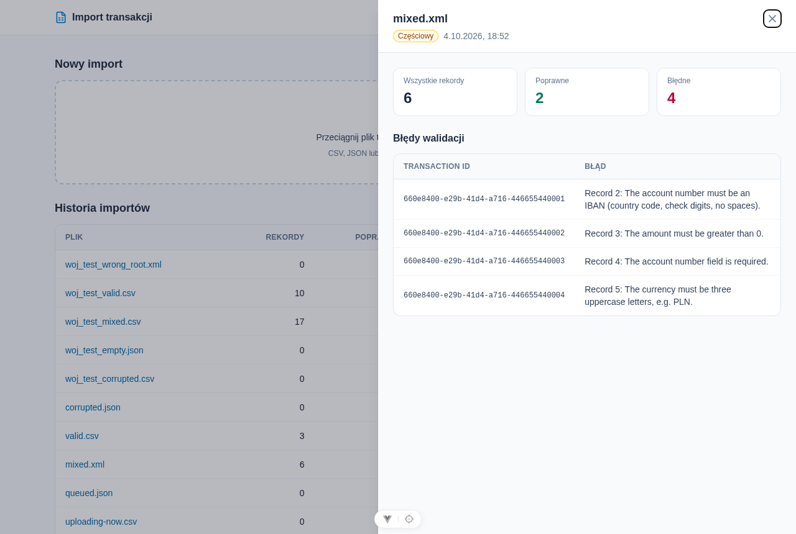

# Import transakcji bankowych

Aplikacja do importu transakcji bankowych z plików **CSV, JSON i XML**. Dodajesz plik, system sprawdza każdy rekord:
poprawne zapisuje, błędne odkłada do logów z opisem problemu. Na liście widać historię importów, a po kliknięciu
w import – które rekordy się nie udały i dlaczego.

| Lista importów | Błędy wybranego importu |
| -------------- | ----------------------- |
|  |  |

**Stos:** Laravel 12 (PHP 8.4) + PostgreSQL 17 + kolejka Laravela po stronie backendu, Vue 3 + TypeScript + Vite + Tailwind
na froncie. Całość uruchamia Docker Compose.

---

## Szybki start

Potrzebny jest tylko Docker z Compose v2.

```sh
cp backend/.env.example backend/.env
docker compose up -d --build
docker compose exec app php artisan key:generate
docker compose up -d --force-recreate app queue    # kontenery muszą wczytać nowy APP_KEY
docker compose exec app php artisan migrate --seed  # --seed dodaje przykładowe importy
```

Potem otwórz **http://localhost:5173** i wgraj któryś z przykładowych plików z `backend/tests/fixtures/`:

| Plik                           | Co zobaczysz                                                        |
| ------------------------------ | ------------------------------------------------------------------- |
| `valid.csv` / `.json` / `.xml` | status **Sukces** – 3 poprawne transakcje                           |
| `mixed.csv` / `.json` / `.xml` | status **Częściowy** – 2 poprawne, 4 błędne (zły IBAN, kwota 0, brak konta, waluta `EURO`) |
| `corrupted.*`                  | status **Błąd** – plik jest uszkodzony, nic nie zostaje zapisane    |
| `brief-example.csv`            | dane z treści zadania – oba rekordy odrzucone, patrz [decyzje](#decyzje-względem-briefu) |

Ten sam `transaction_id` można zaimportować tylko raz, więc drugi upload tego samego pliku skończy się błędami
„already been imported”. Czysty stan bazy: `docker compose exec app php artisan migrate:fresh --seed`.

Upload działa też bez frontu:

```sh
curl -F "file=@backend/tests/fixtures/mixed.csv" http://localhost:8000/api/imports
```

## Jak to działa

1. **Upload.** API sprawdza tylko sam plik (rozszerzenie `csv/json/xml`, maks. 10 MB), zapisuje go, tworzy import
   ze statusem *Oczekuje* i od razu odpowiada `202`. Nie czekasz na przetworzenie dużego pliku.
2. **Przetwarzanie w tle.** Worker kolejki czyta plik rekord po rekordzie i waliduje każdy z nich.
   Poprawne rekordy trafiają do `transactions`, błędne do `import_logs` – zapis idzie paczkami po 500.
3. **Wynik.** Import dostaje status zależny od wyniku. Front sam odświeża listę co 2,5 s, dopóki coś się przetwarza.

| Status                   | Kiedy                                                       |
| ------------------------ | ----------------------------------------------------------- |
| Oczekuje / Przetwarzanie | plik czeka w kolejce albo właśnie jest czytany              |
| **Sukces**               | wszystkie rekordy poprawne                                  |
| **Częściowy**            | część rekordów poprawna, część trafiła do logów             |
| **Błąd**                 | żaden rekord nie przeszedł, plik był pusty albo uszkodzony  |

### Walidacja rekordu

| Pole               | Reguła                                                     |
| ------------------ | ---------------------------------------------------------- |
| `transaction_id`   | wymagane, nie może się powtórzyć ani w pliku, ani w bazie  |
| `account_number`   | wymagane, poprawny IBAN (format + suma kontrolna mod-97)   |
| `transaction_date` | wymagane, data w formacie `RRRR-MM-DD`                     |
| `amount`           | wymagane, liczba całkowita większa od 0 (w groszach)       |
| `currency`         | wymagane, istniejący kod waluty ISO 4217, np. `PLN`, `USD` |

Każdy błąd w logach ma numer rekordu w pliku, np. *„Record 4: The account number field is required.”* –
dzięki temu łatwo znaleźć wiersz, nawet gdy brakuje mu `transaction_id`.

### Decyzje względem briefu

- **IBAN z sumą kontrolną.** Brief wymaga „IBAN”, więc sprawdzamy go tak jak bank. Przykładowe numery z treści zadania
  (`PL1234…`, `PL9876…`) to placeholdery bez poprawnej sumy kontrolnej, dlatego są odrzucane – celowo.
  Pliki `valid.*` mają prawdziwe, poprawne numery.
- **Waluta** – brief mówi „trzy litery”; dodatkowo sprawdzamy, czy taki kod istnieje, więc `ABC` nie przejdzie.
- **Kwoty w groszach** (`150000` = 1 500,00 PLN), w bazie zawsze liczba całkowita, nigdy `float`.
- **Dodatkowe statusy** `pending` i `processing`, bo plik jest przetwarzany asynchronicznie.
- **Uszkodzony plik to wszystko albo nic** – jeśli plik psuje się w połowie, zapisane wcześniej rekordy są wycofywane,
  a w logach zostaje jeden wpis z opisem błędu pliku.
- **Bez logowania** – to narzędzie wewnętrzne, dostęp chroni sieć albo reverse proxy.

## API

| Metoda | Ścieżka                  | Opis                                                         |
| ------ | ------------------------ | ------------------------------------------------------------ |
| POST   | `/api/imports`           | upload pliku (`multipart/form-data`, pole `file`) → `202`   |
| GET    | `/api/imports`           | lista importów, od najnowszych, `?page=` i `?per_page=`     |
| GET    | `/api/imports/{id}`      | szczegóły importu razem z logami błędów (jak w briefie)      |
| GET    | `/api/imports/{id}/logs` | logi błędów z paginacją – dla dużych importów (poza briefem) |

Błędy zawsze wracają jako JSON, np. `422` z listą błędów walidacji przy złym pliku.

---

## Dla programistów

### Usługi

| Usługa     | Do czego                                    | Adres                 |
| ---------- | ------------------------------------------- | --------------------- |
| `frontend` | Vite dev server, przekazuje `/api` do `app` | http://localhost:5173 |
| `app`      | Laravel API                                 | http://localhost:8000 |
| `queue`    | worker kolejki (`queue:work`)               | –                     |
| `db`       | PostgreSQL                                  | localhost:5433¹       |
| `adminer`  | podgląd bazy (system: PostgreSQL, serwer: `db`, login `gdynia` / `secret`) | http://localhost:8080 |
| `rabbitmq` | opcjonalna kolejka, tylko z profilem `rabbitmq` (panel: `guest` / `guest`) | http://localhost:15672 |

¹ Port na hoście ustawia `DB_FORWARD_PORT` (domyślnie 5433, żeby nie kolidował z lokalnym PostgreSQL).

### Kolejka: baza albo RabbitMQ

Domyślnie joby trzymane są w tabeli `jobs` w PostgreSQL (`QUEUE_CONNECTION=database`). Żeby użyć RabbitMQ:

```sh
# backend/.env: QUEUE_CONNECTION=rabbitmq
docker compose --profile rabbitmq up -d
docker compose up -d --force-recreate app queue   # wczytanie nowego .env
```

Kod się nie zmienia – job trafia do kolejki wskazanej w `.env`. Nieudane joby nadal lądują w tabeli `failed_jobs`.
Zamiast `--profile` można ustawić `COMPOSE_PROFILES=rabbitmq` w `.env` w katalogu głównym.

### Codzienne komendy

```sh
docker compose exec app php artisan test                              # testy backendu (SQLite w pamięci)
docker compose exec app vendor/bin/pint                               # styl PHP
docker compose exec app vendor/bin/phpstan analyse --memory-limit=1G  # Larastan
docker compose exec frontend npm run test:unit -- --run               # testy frontu
docker compose exec frontend npm run lint                             # lint frontu (z poprawkami)
docker compose exec frontend npm run type-check
docker compose logs -f queue                                          # podgląd workera
docker compose restart queue                                          # po zmianie kodu jobów
```

Testy nigdy nie dotykają bazy deweloperskiej – `phpunit.xml` wymusza SQLite `:memory:` i kolejkę `sync`.

Środowisko od nowa (**usuwa dane z bazy**):

```sh
docker compose down -v --rmi local --remove-orphans
docker compose up -d --build
docker compose exec app php artisan migrate --seed
```

### CI

GitHub Actions (`.github/workflows/`) uruchamia osobno backend (Pint, Larastan, testy) i frontend (lint, format,
type-check, testy, build) – tylko gdy zmieniły się pliki danej części. Lokalnie, bez pushu, przez
[act](https://github.com/nektos/act):

```sh
act pull_request -W .github/workflows/backend.yml
act pull_request -W .github/workflows/frontend.yml
```

### Architektura

```
POST /api/imports
  └─ ImportController ── zapis pliku + import (pending) ── 202
       └─ ProcessImport (job w kolejce)
            └─ ImportProcessor
                 ├─ ParserRegistry ─► CsvParser / JsonParser / XmlParser   ← strategia
                 ├─ RecordValidator (reguły Iban, Currency, amount > 0)
                 └─ paczki po 500 w transakcji DB: transactions + import_logs + liczniki
```

- Logika importu żyje w `backend/app/Domain/Import` i nie zależy od HTTP ani kolejki – kontrolery i job tylko ją wywołują.
- **Nowy format pliku** to jedna klasa parsera i jedna linia w `ImportServiceProvider`.
- Parsery czytają pliki strumieniowo (XML przez `XMLReader`, CSV przez `league/csv`), więc duży plik nie ląduje w pamięci.
- Front: `src/api/` (axios), `src/modules/imports/` (store Pinia, polling, komponenty, drawer z logami pod `/imports/:id`),
  `src/components/ui/` (komponenty ogólne).

```
├── .github/workflows/   CI backendu i frontu
├── compose.yaml         środowisko deweloperskie
├── backend/             Laravel: app/Domain/Import, Http, Jobs, Models, Rules; tests/ + fixtures/
├── frontend/            Vue: src/api, src/modules/imports, src/layouts, src/components/ui
└── docs/screenshots/    zrzuty ekranu do tego pliku
```

### Konwencje

- Commity: [Conventional Commits](https://www.conventionalcommits.org/) ze scope `backend`, `frontend`, `docker`, `ci`,
  np. `feat(backend): add xml parser`. Każda zmiana na osobnym branchu, merge do `main`.
- Pieniądze zawsze jako liczba całkowita groszy.
- Każda lista w API jest paginowana i ma jawne sortowanie.
